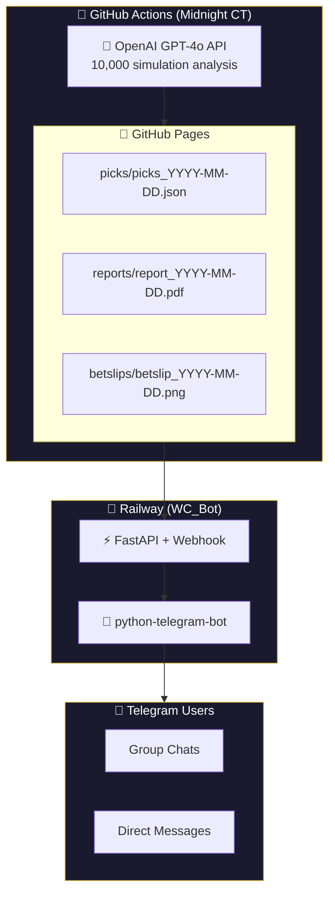

<p align="center">
  
</p>

<h1 align="center">Winning Circle Bot</h1>

<p align="center">
  <b>AI-powered sports betting intelligence delivered via Telegram.</b>
</p>

<p align="center">
  
  
  
  
</p>


## 📋 Overview

Winning Circle Bot is a Telegram bot that delivers daily AI-generated sports betting picks. The bot pulls picks from a centralized GitHub Pages data source, ensuring consistency across all platforms.

### Features

- 🎯 **Daily Picks** - NBA, NHL, NCAAB, and Soccer picks
- 🎫 **Bet Slip Images** - Shareable visual bet slips
- 📄 **PDF Reports** - Detailed analysis with model probabilities
- 📊 **10,000 Simulations** - AI model runs statistical analysis
- ⏰ **Auto-Generated** - New picks every day at midnight CT

---

## 🤖 Bot Commands

| Command | Description |
|---------|-------------|
| `/start` | Welcome message and command list |
| `/help` | Show help information |
| `/picks` | View all today's picks |
| `/slip` | Get today's bet slip image |
| `/report` | Link to full PDF report |

---

## 🏗️ Architecture


---

## 🚀 Deployment

### Prerequisites

- Python 3.11+
- Telegram Bot Token (from [@BotFather](https://t.me/BotFather))
- Railway account

### Environment Variables

| Variable | Description |
|----------|-------------|
| `BOT_TOKEN` | Telegram bot token from BotFather |
| `BASE_URL` | Railway public URL (e.g., `https://wcbot-production.up.railway.app`) |
| `WEBHOOK_SECRET` | Secret string for webhook security |

### Deploy to Railway

1. **Fork/Clone this repo**

2. **Create new Railway project**
   ```
   railway init
   ```

3. **Add environment variables**
   ```
   railway variables set BOT_TOKEN=your_token_here
   railway variables set BASE_URL=https://your-app.up.railway.app
   railway variables set WEBHOOK_SECRET=your_secret_here
   ```

4. **Deploy**
   ```
   railway up
   ```

5. **Set bot commands in BotFather**
   ```
   /setcommands
   
   start - Welcome message
   help - Show help
   picks - Today's picks
   slip - Bet slip image
   report - Full PDF report
   ```

---

## 📁 Project Structure

```
WC_Bot/
├── main.py              # FastAPI app + Telegram bot handlers
├── requirements.txt     # Python dependencies
├── Procfile            # Railway start command
├── railway.json        # Railway configuration
└── README.md           # This file
```

---

## 📦 Dependencies

```txt
fastapi
uvicorn
python-telegram-bot
httpx
pytz
```

---

## 🔗 Data Sources

The bot fetches data from GitHub Pages:

| Resource | URL |
|----------|-----|
| Latest Picks JSON | `https://lloredia.github.io/Winning-circle/picks/latest.json` |
| Daily Picks | `https://lloredia.github.io/Winning-circle/picks/picks_YYYY-MM-DD.json` |
| PDF Reports | `https://lloredia.github.io/Winning-circle/reports/report_YYYY-MM-DD.pdf` |
| Bet Slips | `https://lloredia.github.io/Winning-circle/betslips/betslip_YYYY-MM-DD.png` |

---

## 🧪 Testing

### Health Check
```bash
curl https://your-app.up.railway.app/
# Returns: {"status": "ok", "bot": "Winning Circle"}
```

### Debug Picks
```bash
curl https://your-app.up.railway.app/debug/picks
# Returns current picks data from GitHub Pages
```

---

## 📊 JSON Schema

```json
{
  "date": "2026-02-06",
  "generated_at": "2026-02-06T00:05:00-06:00",
  "leagues": {
    "underdog": {
      "raw_text": "Full AI analysis...",
      "picks": [
        {
          "league": "underdog",
          "pick": "Orlando Magic ML",
          "odds": "+180",
          "confidence": "High",
          "model_prob": "48%",
          "reason": "Strong home record..."
        }
      ]
    },
    "soccer": {
      "raw_text": "Full AI analysis...",
      "picks": [...]
    }
  }
}
```

---

## 🔒 Security

- Webhook endpoint protected by secret token
- No API keys stored in code
- All sensitive data in environment variables

---

## 📝 License

For entertainment purposes only. Not financial advice. Gamble responsibly.

---

## 🤝 Related Projects

- [Winning-circle](https://github.com/lloredia/Winning-circle) - Main pipeline that generates picks

---

## 👤 Author

**Lesley Lloredia**
- GitHub: [@lloredia](https://github.com/lloredia)

---

<p align="center">
  <b>🏆 WINNING CIRCLE</b><br>
  <i>AI-Powered Betting Intelligence</i>
</p>
